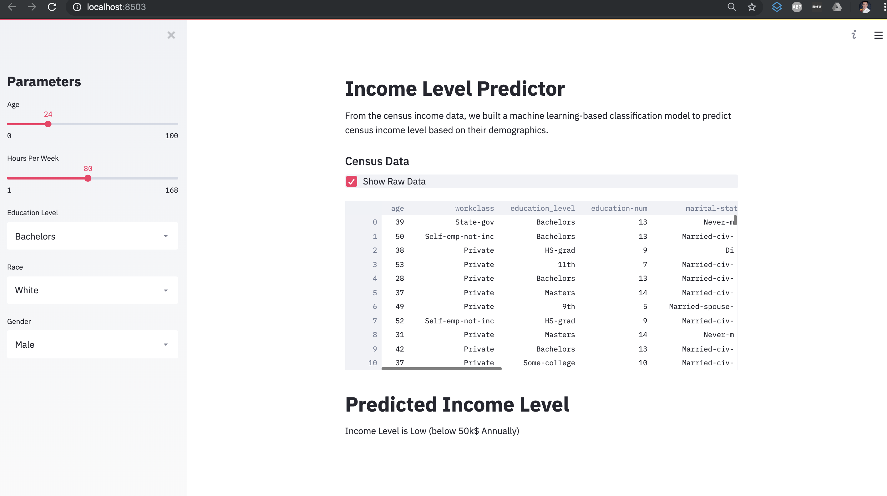

# Census Income Web Application  
Author: Xavier M. Puspus  

# Deployed Application  
Here's a [link](https://census-income-predictor.herokuapp.com/) to the web application hosted in Heroku.

### Description
I used a sample dataset on census income brackets and built a simple web application with a machine learning backend to see live predictions on income bracket based on changes in input data.

### Data

You can get the [data and data description](https://archive.ics.uci.edu/ml/datasets/census+income) here.
 
### Model

I only used a low-order machine learning technique for demo purposes. The web app's backend can work for more complex models.

### Deployment Through Web Application

I used the most recently released API of [Streamlit](https://streamlit.io) to deploy the ml model and locally serve the web app.

### Running the App

In order to run the app, you must have the basic data science packages available on your machine, (`pandas`, `numpy`, `seaborn`, `matplotlib`, `sklearn` and install streamlit using:

```console
foo@bar:~$ pip install streamlit
```
Afterwards, `cd` into the directory of `app.py` and run this on the terminal:

```console
foo@bar:~$ streamlit run app.py
```

### Display

The web app should look something like this:

